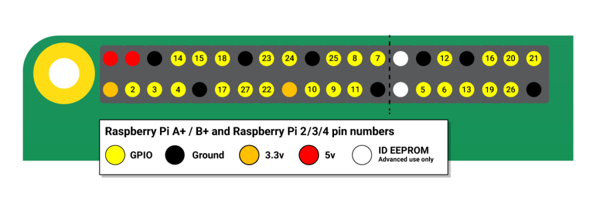
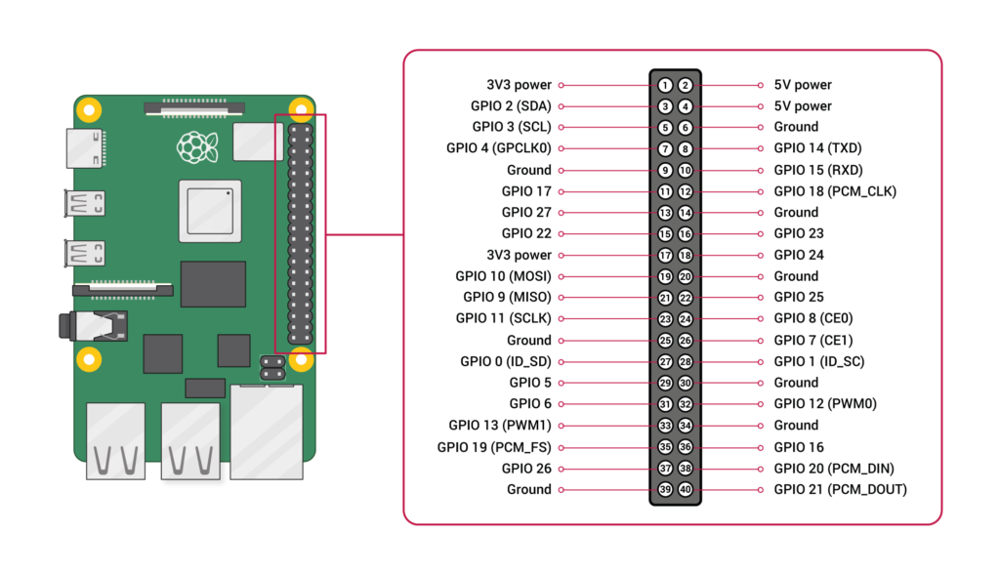

# rpi4-conf

## using the raspberry pi 4 as a desktop machine
### with a chromebook level of performance

this config provides a overclocked pi, more allocated vram

and a powerbutton using gpio-shutdown on gpio3

photos will follow soon, when i finally made it look presentable lol
