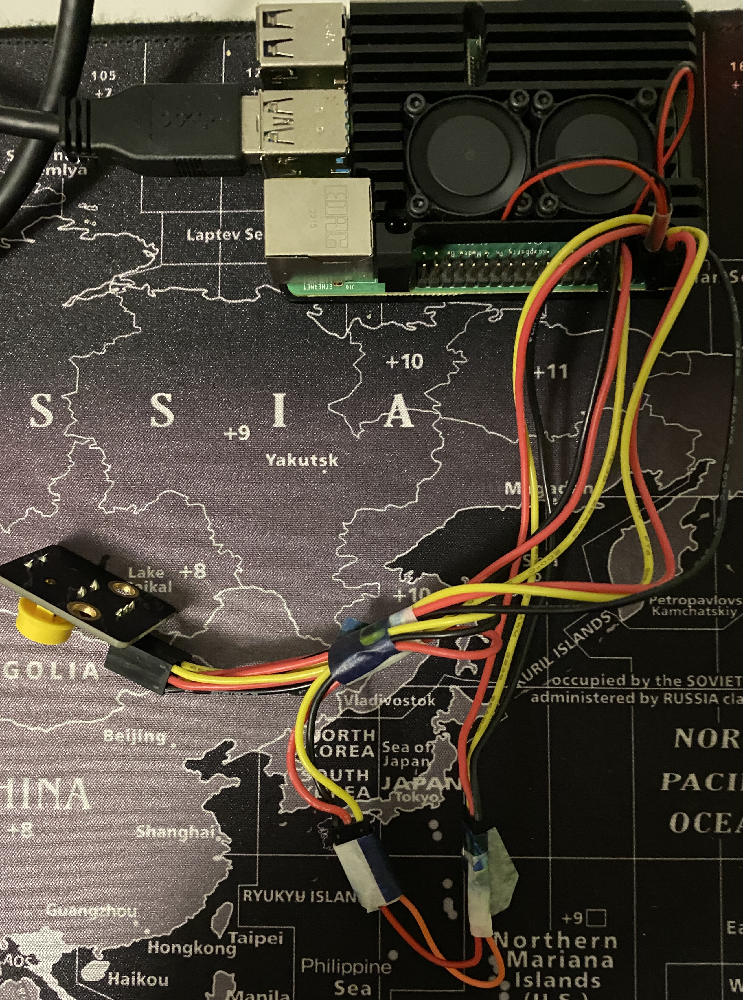
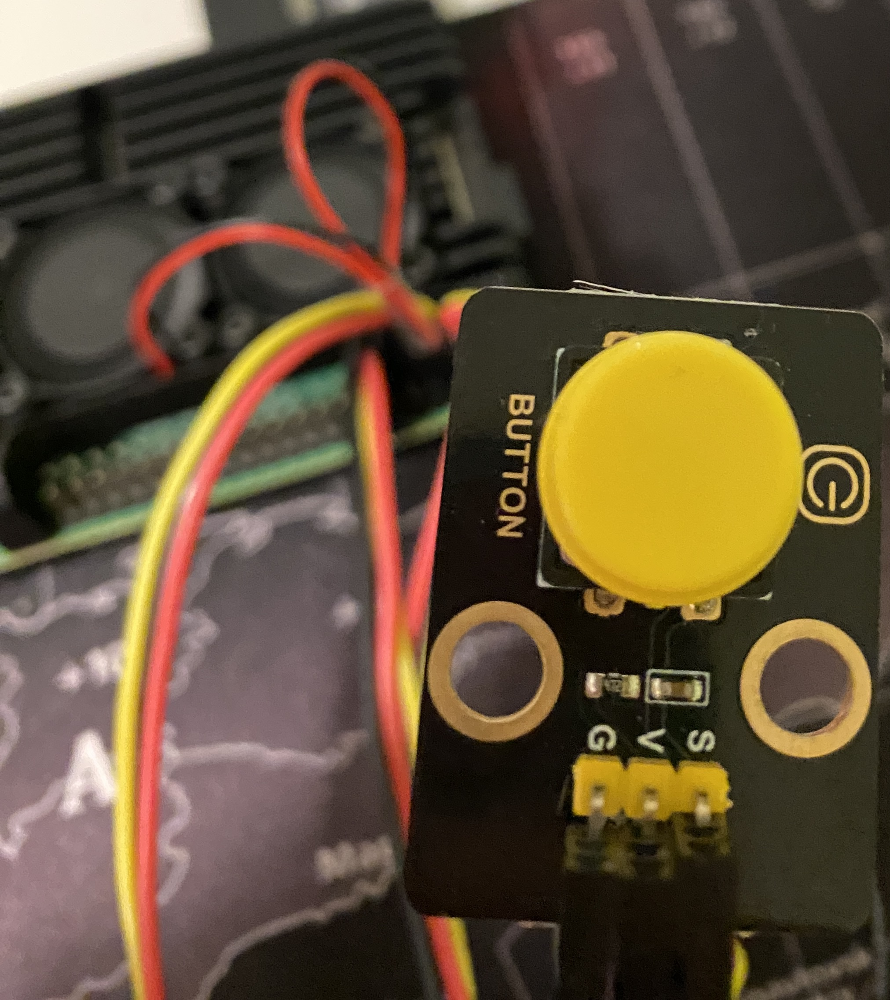

# rpi4-conf

## using the raspberry pi 4 as a desktop machine
### with a chromebook level of performance

this config provides a overclocked pi, more allocated vram

and a powerbutton using gpio-shutdown on gpio3
the fan uses the second 5V Pin in the first row and the ground pin next to it
--> always on, as long as there is power

that i how i build a powerbutton using a button with a digital signal lane, V And G

the button module is from the keyestudio smart home kit
--> the button only works this way, because it is getting 3V to V(U) and gpio3 as S
(Ground is Ground ofc)

Inspiration: <https://www.stoffl.net/2020/03/31/how-to-raspberry-pi-4-gpio-ein-und-ausschalten-power-on-off-button/>